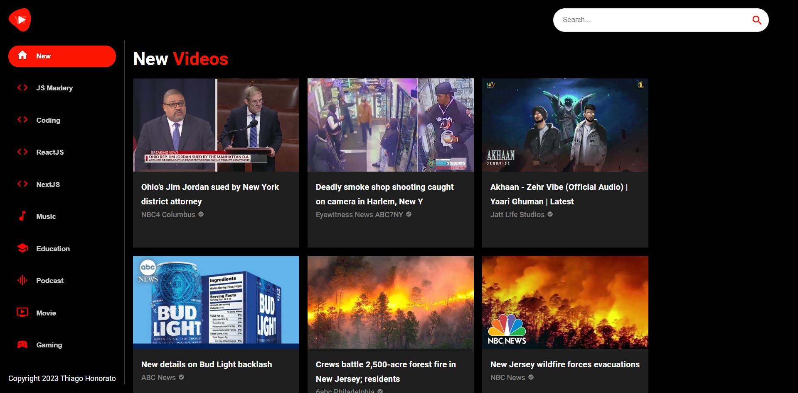

<h1 align="center"> Youtube Clone </h1>

Projeto desenvolvido em React, com base nos ensinamentos do vídeo - [Build and Deploy a Modern YouTube Clone Application in React JS with Material UI 5 | RapidAPI](https://youtu.be/FHTbsZEJspU) do canal [@javascriptmastery](https://www.youtube.com/@javascriptmastery) no Youtube. 

<p align="center">
  <a href="#-tecnologias">🚀 Tecnologias</a>&nbsp;&nbsp;&nbsp;|&nbsp;&nbsp;&nbsp;
  <a href="#-projeto">💻 Projeto</a>&nbsp;&nbsp;&nbsp;|&nbsp;&nbsp;&nbsp;
  <a href="#-instruções"> 📋 Instruções</a>&nbsp;&nbsp;&nbsp;|&nbsp;&nbsp;&nbsp;
  <a href="#-layout">🔖 Layout</a>&nbsp;&nbsp;&nbsp;|&nbsp;&nbsp;&nbsp;
  <a href="#memo-licença">📝 Licença</a>
</p>

<br>

<p align="center">
  
</p>

## 🚀 Tecnologias

Esse projeto foi desenvolvido com as seguintes tecnologias:

- [NodeJS](https://nodejs.org/)
- [Rapid API](https://rapidapi.com/hub)
- [ReactJS](https://reactjs.org/)


<br>

## 💻 Projeto

O Youtube Clone é um projeto que tem por finalidade tentar replicar algumas das funcionalidades da famosa plataforma de compartilhamento de vídeos mantido pelo Google. Para tanto, foi utilizando o framework React, assegurando os benefícios da tecnologia, permitindo que o código seja mais objetivo, reutilizando os componentes comums, garantindo assim um alto desempenho. Neste projeto, houve o consumo de uma API disponibilizada pelo Rapid API.


## 📋 Instruções

### Clone o projeto e acesse a pasta.

```bash
$ git clone https://github.com/ThiagoMonts/youtube_clone.git
```
```bash
$ cd youtube_clone
```

<br>

### Siga o passo a passo:

Instale as dependências
```bash
$ cd youtube_clone
```
```bash
$ npm install
```

<br>

Inicie o projeto
```bash
$ npm start
```

<br>


## 🔖 Layout

Você pode acessar o site através [DESSE LINK](https://thiagomonts-youtube-clone.netlify.app/).

<br>

## 📝 Licença

Esse projeto está sob a licença MIT.

---

Desenvolvido por [Thiago Honorato](https://www.linkedin.com/in/honoratothiago/)
